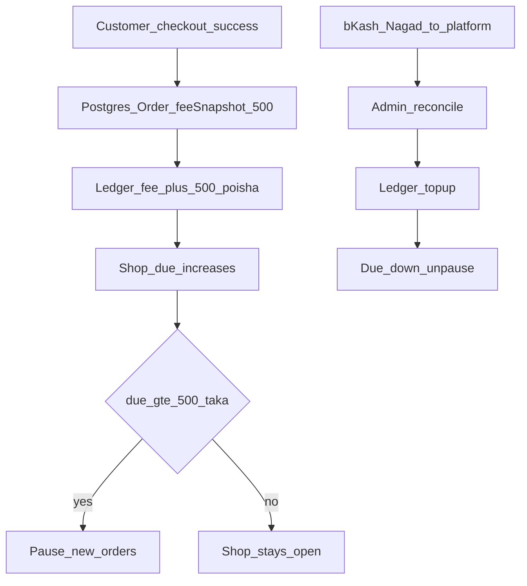
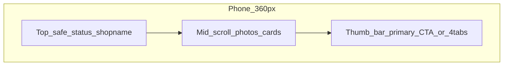
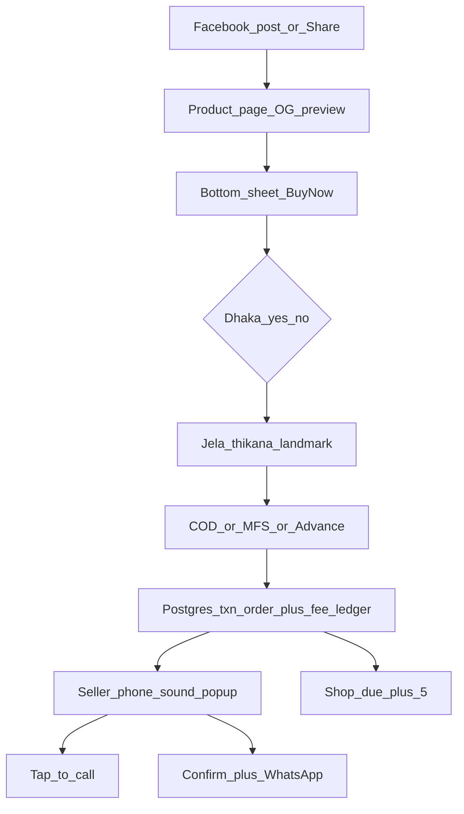

# HaatLink — Production Product Plan

**Product:** HaatLink (হাটলিংক)

**Asol product = landing page + shopkeeper order tool.** HaatLink Shopify-scale marketplace noi. Public site **ekta professional promotion/landing**. Okhane shopkeeper form diye register kore. Tarpor or ekta shop link + order inbox. Customer Facebook theke oi link e giye order dey.

**Business (fixed):** Shopkeeper **প্রতি অর্ডার ৫ টাকা** platform ke dey. Joto order asbe, sei onujayi — 10 order = ৳50, 100 order = ৳500. Monthly package nai. Free trial package nai. Charge = incoming order count × ৳5.

**Tagline (BN):** ফেসবুকে লিংক দিন। অর্ডার আসবে গোছানো। প্রতি অর্ডার মাত্র ৫ টাকা।
**Tagline (EN):** One link. Clean orders. ৳5 per order. No monthly fee.

**Ke use korbe**

- **Visitor (landing):** product bujhe, price dekhe, form diye dokaan khule
- **Shopkeeper:** shop, product, order, bKash/Nagad, **billing (৳5 × orders)**
- **Customer:** account nai. Nam, phone, thikana, pay. Customer **কখনো ৫ টাকা দেয় না** — eta shopkeeper er platform fee
- **Apni (platform owner):** landing, seller, billing ledger, due collection, support, production ops

---

## Scope — ki asol, ki na

**Muloto ei 3 ta surface production e live thakbe:**

1. **Landing `/`** — promotion, pricing (৳5/order), FAQ, legal, **shop register form**
2. **Shopkeeper `/app`** — products, orders, shop settings, **hisab (billing)**
3. **Customer shop `/s/[slug]`** — Facebook link, Buy Now, checkout (eta fee generate kore)

Admin `/admin` = internal ops, landing e show hobena.

**Ei plan e “marketplace” mane:** onek shopkeeper, ekta platform. Customer-to-customer bazaar, multi-vendor cart, ba public shop directory **v1 te nai**. Landing theke register → nijer shop. Search-all-shops Amazon-style skip.

**Deliberately skip (jate sohoj + production sober thake):** coupon jungle, reviews, wholesale, staff roles, Excel, email login, customer accounts, AI chatbot, full card gateway for *customers* at launch (COD + bKash/Nagad screenshot thakbe). Shopkeeper **platform fee** pay alada — ota production billing.

---

## Money law — প্রতি অর্ডার ৳5 (production)

Ei rules lock. Code e magic number noi — `PlatformSettings.feePerOrderPoisha = 500`. Order create howar somoy **snapshot** `Order.platformFeePoisha` e save (pore fee 6 taka hole purono order 5-i thakbe).

1. **Billable event = customer order successfully created** (checkout POST commit). Demo shop `/s/demo` orders **billable na**.
2. **Customer pay shopkeeper** (COD/bKash/Nagad/advance) — platform oi taka nibe na. HaatLink sudhu **৳5 service fee**.
3. **Shopkeeper pay platform** ৳5 per order. Formula: `due = (billableOrders × 5) − settledPayments`.
4. **Cancel/fake:** seller “ফেক / ক্যান্সেল” korle **fee credit** (ledger `fee_reversal`) — fake order e 5 taka kata jabe na. Delivered/confirmed e reversal nai.
5. **Customer never blocked** for unpaid shopkeeper due. Order always save. Collection = shopkeeper side.
6. **Due cap (production collect):** due ≥ ৳500 (100 unpaid-fee orders) → shop **pause new orders** (page open thake, order button lock) + landing-style banner “৫ টাকা হিসাব মিটিয়ে দোকান চালু করুন”. Admin override.
7. **Pay due:** shopkeeper bKash/Nagad e platform number e pathay (TrxID + screenshot) → status `pending_review` → admin confirm → wallet credit. Pore: bKash Merchant / SSLCommerz auto.
8. **Ledger immutable.** Edit = new reversing entry. Taka always **integer poisha**. Float nai.
9. **Idempotent:** same checkout retry = same order, fee **ekbar**. Unique `idempotencyKey`.
10. **Transparency:** shopkeeper Home e always: `আজকের অর্ডার ১২ × ৫ = ৬০ টাকা বাকি`. Landing e same math example.

**Udahoron**

| Orders aslo | Fee | Shopkeeper dey |
| --- | --- | --- |
| 1 | ৳5 | ৳5 |
| 23 | ৳5 × 23 | ৳115 |
| 0 | ৳0 | ৳0 |

Landing copy: **মাসিক চার্জ নেই। অর্ডার না এলে টাকা নাই। অর্ডার এলেই প্রতিটায় ৫ টাকা।**

---

## Design law — sorboccho sohoj

Ei 12 ta law na manle feature add kora jabe na. Easy product er asol secret holo **kom kaj**, beshi feature noi.

1. **Landing desktop-professional + shop mobile-first.** Marketing `/` full-width human site (laptop + phone). Shopkeeper app phone-first, desktop e usable sidebar. Customer shop duita tei sajano.
2. **Sudhu porte pare.** Icon + rong + boro lekha. English jargon nai. Tap target 48px+. Font 18px+. **Boro lekha** toggle dashboard e.
3. **3 theke beshi decision ek screen e nai.**
4. **Chobi > table.** Order = product photo + nam + phone. Spreadsheet UI nai (admin billing table `md+` ok).
5. **Facebook er habit maro na — replace koro.** Confirm korle WhatsApp auto khulbe default.
6. **Cart-first noi, Buy Now.** Primary: **এইটা অর্ডার করুন**.
7. **Form page noi (customer).** Checkout = **bottom sheet**. Shopkeeper register = landing e visible form (`#register`).
8. **2G e cholbe.** Photo compress ~200KB. Bangla font self-host. JS kom.
9. **Email nai. Password nai.** Shopkeeper = phone + 4-digit **ATM PIN**. Customer = guest.
10. **Fake-order-i #1 dushmon.** Advance + call-to-confirm + block — **and fee reversal on fake cancel**.
11. **Galat delivery #2 dushmon.** “Dhaka?” ha/na + landmark. Delivery charge auto.
12. **Ekta kaj, ekta rasta.** Pricing sudhu landing + shopkeeper Hisab — 3rd jaygay alada rule nai.

---

## Production landing `/` (primary surface)

Eta demo poster noi. **Conversion + trust + legal + register** — production marketing site.

**Must sections (desktop 2-col / mobile stack):**

1. **Hero** — 1 line problem, 1 line ৳5, primary **দোকান খুলুন** → `#register`, secondary **ডেমো দেখুন** → `/s/demo`
2. **Kivabe kaj kore** — 3 step: Link din → Order asbe → ৳5 hisab
3. **Price block (lock copy):** বড় ৫, “প্রতি অর্ডার”, “মাসিক ০ টাকা”, calculator: order count slider → live ৳
4. **Register form (same page, no extra signup site):** shop nam, phone, PIN, category. Success → `/app`. Duplicate phone = login hint
5. **Trust:** BD, COD, bKash/Nagad, HTTPS, “কাস্টমার ৫ টাকা দেয় না”
6. **Live demo** — real `/s/demo`, iframe nai
7. **FAQ:** ke dey 5 taka, cancel hole, due 500 e ki hoy, PIN harale
8. **Footer production:** Terms, Privacy, Billing terms, Contact/WhatsApp support, company nam

Sticky mobile CTA: **দোকান খুলুন · প্রতি অর্ডার ৫৳**

OG/Twitter for ads: photo + “প্রতি অর্ডার ৫ টাকা”. Facebook Pixel / Conversion API **production landing only** (consent note in Privacy).

Lighthouse production bar: LCP **< 2s** 4G, CLS < 0.1, form usable 3G.

---

## Mobile-first — prottek part kivabe design

**Default canvas shop/app:** **360×800** (Redmi/Itel/Samsung A-series). **Landing:** full desktop width, `lg` 2-col, mobile ek column — stretched-phone layout **landing e nai**.

### Thumb map (shop + shopkeeper app)

Phone vertically 3 zone:

- **Upore (hard):** status, shop nam, language
- **Majhe (eye):** photo, order list, form
- **Niche (thumb, 72px + safe-area):** ekta primary kaj

**Hard rules (shop + app)**

- Tap **min 48×48**, primary **56px** height
- Font 16px body, 20–24px price/CTA
- `viewport-fit=cover` + `env(safe-area-inset-bottom)`
- `100dvh`; keyboard: `inputMode=numeric`; `visualViewport` e thumb CTA
- Facebook in-app browser QA
- Reduced motion

### 1. Marketing landing — production

- Desktop: nav (Price, Demo, FAQ, Register), wide hero, price card, form in view
- Mobile: ek kotha + sticky **দোকান খুলুন**
- Price always visible above fold or 1 scroll
- Language toggle top-right, 44px+
- Form errors Bangla, honeypot + rate limit (production: IP + phone)

### 2. Shopkeeper login / PIN

- Full screen ATM pad 72×64
- Phone → PIN
- Production: lock 10 fail / 15 min; support PIN reset via admin audit

### 3. Onboarding

- 1 step = 1 screen: nam + category → theme → first product
- Seshe: link + **Hisab bujhiye 1 line:** “প্রতি অর্ডার ৫ টাকা, অর্ডার না এলে ০”

### 4–7. Customer shop / product / checkout / thank-you

Ager plan same: cover, 1-col feed, Buy Now sheet, Dhaka ha/na, COD/bKash/Nagad/advance, thank-you screenshot + call.

Checkout production extras: CSRF/origin check, honeypot, rate limit per IP+phone, idempotency key, stock transaction, **fee ledger same DB transaction e** as Order insert.

### 8. Shopkeeper PWA — 5th surface: Hisab

Bottom nav **4 + billing access:** Home, Orders, Products, Shop. Home card 4th metric: **বাকি ৳**. Shop settings e **হিসাব** section:

- Ei month: orders × 5
- Baki taka boro
- Pay: platform bKash/Nagad copy + TrxID + screenshot
- History list (ledger, human Bangla: “অর্ডার HL-… ফি ৫৳”, “পেমেন্ট কনফার্ম ২০০৳”)

Nav optional 5th tab **হিসাব** jodi due > 0 (red dot).

New order popup unchanged (call / WhatsApp).

### 9. Admin — production ops

Laptop primary. Cards on phone.

- Shops, disable, PIN reset (audit)
- **Billing queue:** pending topups, due aging, pause-for-due list
- Fee setting (default 500 poisha) — change = future orders only
- Demo shop (never billed)
- Reconcile: TrxID unique, double-credit block
- Refund fee / adjust with reason (ledger + admin user id)

### 10. PWA / Android

- `display=standalone`, HTTPS only (camera)
- Notify after first **real** order
- `tel:` + `wa.me`

### Device QA (production must)

- Chrome Android 360 + Facebook in-app
- Samsung Internet
- iPhone Safari 390
- Desktop 1280 + 1440 landing
- 3G throttle
- Keyboard-open checkout
- Staging sign-off checklist before prod deploy

**Breakpoints:** landing `lg` marketing layout. Shopkeeper `md+` sidebar allowed. Customer shop readable on desktop (not 480px-only).

---

## Killer features

1. **Fake-order shield** + fee reversal on fake cancel
2. **Confirm + WhatsApp ek tap**
3. **Dhaka? Hã / Na**
4. **Ager thikana** (localStorage)
5. **Facebook Share Sheet** + QR
6. **Lekha theke product** (caption paste)
7. **Pause shop**
8. **৳5 per order, no monthly** — landing e clear, ledger e accurate (unique vs Shopify/subscription tools)

---

## Tech stack — production (not local-demo)

Ekta Next.js app. Shop SSR = Facebook OG. Landing + app + API same repo.

| Layer | Production choice | Keno |
| --- | --- | --- |
| App | Next.js 15 App Router + TypeScript | OG + one codebase |
| UI | Tailwind + tokens (10 themes) | 10 app noi |
| i18n | next-intl, `bn` default | |
| DB | **PostgreSQL** (Neon/Supabase/RDS) | money + ledger; **SQLite prod e nai** |
| ORM | Prisma, migrate in CI | |
| Auth | phone + PIN, httpOnly cookie, signed, `SESSION_SECRET` 32B+ | Better Auth optional |
| Files | S3 / Cloudflare R2, signed URLs, virus size cap | local disk prod e nai |
| Images | browser compress then upload | |
| Font | self-hosted Hind Siliguri | |
| Host | Vercel (or similar) + **separate staging** | |
| Cache | shop ISR; landing CDN | |
| Queue (v1.1) | optional; v1 sync ledger in request is OK if txn short | |
| Realtime | 8s poll + sound; Pusher later | |
| Errors | Sentry + source maps | |
| Logs | structured JSON, no PIN/secrets | |
| Uptime | health `/api/health` (db ping) + uptime robot | |
| Analytics | landing page views + register + order count; no customer PII in 3rd party | |

**Local:** SQLite or Postgres docker. **Staging:** prod-like Postgres, fake SMS, dummy bKash numbers. **Prod:** managed Postgres, daily backup + PITR, secrets in host env not git.

**Keno na:** WordPress plugin hell. Shopify mehnga + ৳5 model native nai. Firebase money/ledger weak.

**Accuracy (DB)**

- Phone `01XXXXXXXXX`
- Taka **integer poisha**
- Stock + order + **ledger fee** ek `prisma.$transaction`
- Duplicate customer order: same phone + product + 10 min = warn
- Order code `HL-260916-0042`
- Rate limit + honeypot
- Blocked phone shop-level
- Ledger `idempotencyKey` unique
- TrxID unique per shop payment

---

## Production ops, security, legal

**Environments:** `development` | `staging` | `production`. Separate DB, R2 prefix, cookies `Secure; HttpOnly; SameSite=Lax`.

**Secrets:** `DATABASE_URL`, `SESSION_SECRET`, `ADMIN_PIN` (prod = long random, not 123456), object-storage keys, Sentry DSN. Rotate runbook.

**Backups:** automated daily + WAL/PITR 7–14 day. Monthly restore drill on staging.

**Security:** HTTPS, security headers, upload mime/size, rate limit register/login/checkout, admin IP allow optional, audit table for PIN reset / fee adjust / shop disable.

**PII:** customer phone/address = shopkeeper data. Privacy: who stores, how long, delete shop request. Backup retention disclosed.

**Legal pages (landing footer, production required):** Terms, Privacy, **Billing (প্রতি অর্ডার ৫৳, due cap, fake reversal)**.

**Support:** WhatsApp/phone on landing. Admin can pause shop, reset PIN, confirm payments.

**CI:** `prisma migrate`, `tsc`, lint, staging deploy on main PR, prod on tag. Never migrate prod by hand without backup.

**Observability:** order create success rate, checkout errors, fee ledger mismatch nightly job (`sum(fees) - sum(reversals) - sum(topups) == due`), Sentry alerts.

**Capacity:** v1 single region BD-close if possible. Image CDN. Connection pool sized for serverless.

---

## Information architecture

**Public (landing-first)**

- `/` — production marketing + **register** + price ৳5
- `/terms` `/privacy` `/billing` — legal
- `/s/[shopSlug]` — shop
- `/s/[shopSlug]/p/[productSlug]` — product + OG
- `/s/[shopSlug]/order/[orderId]` — thank you
- `/login` — shopkeeper PIN
- `/s/demo` — not billed

**Shopkeeper `/app`**

- Home — orders today, new, taka, **বাকি ৳**
- Orders
- Products
- Shop — design, delivery, pay numbers, pause, **হিসাব / pay due**

**Admin `/admin`**

- Sellers, billing queue, fee config, demo content, audit

---

## Shopkeeper onboarding

Login: ATM pad. Forgot PIN = support (SMS later).

**3 step:** nam + category → theme → first product (or sample).

Register **landing form theke** — alada weak signup page noi.

Try-without-signup: dummy dashboard from landing; **real orders + ৳5 only after real shop**.

---

## Customer: 4-tap order (guest)

Unchanged flow: Facebook-like shop, Buy Now sheet, Dhaka ha/na, landmark, COD/bKash/Nagad/advance, thank you.

Customer UI te platform fee **dekhano jabe na** (otar day shopkeeper er).

---

## 10 built-in designs (tokens)

`ShopRenderer` + 10 JSON.

1. Shada Dokaan 2. Fashion Studio 3. Rongin Saj 4. Rannaghor 5. Gadget Dark 6. Shishu 7. Sonar Haar 8. Khamar 9. Flash Sale 10. Puran Dhaka

---

## Bangla / English

Default **Bangla**. Digit **English**. Errors Bangla. Billing copy spoken: “প্রতি অর্ডার পাঁচ টাকা”, “বাকি”, “হিসাব মিটান”.

---

## Shopkeeper dashboard (order inbox)

New order = popup + sound + vibrate.

Status: `new → confirmed → shipped → delivered` / cancel. Fake cancel → **fee reversal**.

**Hisab (production):** due, pay instructions, pending payment, history. Pause-for-due = same pause UX as “Aj order nicchi na” plus reason “হিসাব বাকি”.

---

## Data model (production)

- `User` — phone, pinHash, locale, fontScale, failedPinCount, lockedUntil
- `Shop` — slug, name, category, themeId, cover, avatar, fbPageUrl, whatsapp, callPhone, bkashNumber, nagadNumber, fees, advance, paused, pauseReason (`manual|due|admin`), language
- `Product` — as before
- `Order` — as before + **`platformFeePoisha`** + `feeReversedAt` + `idempotencyKey`
- `MessageTemplate`, `BlockedPhone`, `Theme`
- `PlatformAdmin` — hashed PIN, lastLoginAt
- `PlatformSettings` — `feePerOrderPoisha` (500), `duePausePoisha` (50000), platform bKash/Nagad numbers
- `ShopBalance` — `duePoisha` denormalized cache (source of truth = ledger)
- `LedgerEntry` — id, shopId, orderId?, paymentId?, type (`order_fee|fee_reversal|topup|adjust`), amountPoisha (+/−), idempotencyKey unique, createdAt, actor (`system|adminId`)
- `ShopPayment` — method `bkash|nagad`, trxId unique, screenshotUrl, amountPoisha, status `pending|confirmed|rejected`, reviewedBy, reviewedAt
- `AuditLog` — actor, action, meta JSON

Customer memory: localStorage. Repeat badge = delivered count.

---

## Phase 1 — Production launch

Must, extra nai — **but production-grade, demo-grade noi**.

- Landing professional (desktop+mobile): price ৳5, register form, legal, demo shop
- ATM PIN, onboarding, sample product, PWA
- 10 themes, Buy Now sheet, guest checkout
- Order inbox, WhatsApp, pause, share/QR
- **৳5 ledger + Hisab + admin reconcile + due pause at ৳500**
- Postgres prod, R2/S3, backups, Sentry, health, staging, secrets, rate-limit
- Admin, bn/en, OG, 2G, honeypot
- Call/WhatsApp storefront

**Phase 2:** courier APIs, SMS OTP, Pixel, custom domain, staff PIN, print, auto bKash merchant for **platform fee**, invoice PDF

**Phase 3:** analytics for shopkeeper, remove HaatLink badge optional paid extra — **not a 499/mo plan** unless later; default remains **৳5/order**

---

## Project files

- [app/page.tsx](app/page.tsx) — production landing + register + ৳5 price
- [app/billing/page.tsx](app/billing/page.tsx) / terms / privacy
- [app/s/[shopSlug]/page.tsx](app/s/[shopSlug]/page.tsx)
- [app/s/[shopSlug]/p/[productSlug]/page.tsx](app/s/[shopSlug]/p/[productSlug]/page.tsx)
- [app/app/page.tsx](app/app/page.tsx) — shopkeeper PWA + Hisab
- [app/admin/page.tsx](app/admin/page.tsx) — billing queue
- [components/shop/ShopRenderer.tsx](components/shop/ShopRenderer.tsx)
- [components/shop/CheckoutSheet.tsx](components/shop/CheckoutSheet.tsx)
- [components/landing/RegisterForm.tsx](components/landing/RegisterForm.tsx)
- [components/landing/PriceBlock.tsx](components/landing/PriceBlock.tsx)
- [lib/billing/fee.ts](lib/billing/fee.ts) — 500 poisha, snapshot, due cap
- [lib/billing/ledger.ts](lib/billing/ledger.ts)
- [lib/themes/index.ts](lib/themes/index.ts)
- [lib/geo/bd-districts.ts](lib/geo/bd-districts.ts)
- [prisma/schema.prisma](prisma/schema.prisma)

---

## Success bar

- Landing theke register: **2 minute**
- Shopkeeper first link: **3 minute**
- Customer order: **30 second**
- **Hisab shothik:** 7 order = ৳35 due, 1 fake cancel = ৳30
- Facebook preview e photo + ৳
- Fake order: advance + call-confirm + block + fee reverse
- Shop LCP **< 2s** 4G; landing desktop professional
- 360px e kono cut CTA; Facebook in-app e order + `wa.me`
- Prod: backup restore tested, Sentry live, `ADMIN_PIN` not default, SQLite not in prod
- Nightly: ledger vs due **zero mismatch**

---

## Build order (remaining production)

1. PlatformSettings + Ledger + ShopPayment + fee snapshot on Order (same txn)
2. Shopkeeper Hisab UI + due pause
3. Admin billing queue + audit
4. Landing price block + billing legal + calculator
5. **Scale must-do (step 1–2):** Postgres + R2/S3 — nicher scaling plan
6. QA: fee math, double-submit, fake reversal, due cap, landing register
7. Traffic/SaaS scale steps **sudhu traffic onujayi** — sob eksathe na

---

# Boro Scale-er Jonno Scaling Plan

Ei plan **priority order** e sajano. Traffic onujayi phase kore implement — **sob eksathe korar dorkar nai.**

**Ekhon codebase:** Prisma **SQLite**, local `/api/upload`, **bcryptjs**, simple rate-limit, jose cookie session. Sentry / CI / Redis **nai**. Nicher steps oi gap bondho kore.

---

## 1. Database: SQLite theke PostgreSQL

Prisma schema-r datasource shudhu change: `provider = "postgresql"`. Host: **Supabase, Neon, ba Railway** (free/cheap start). Connection pooling: **PgBouncer** ba **Prisma Accelerate** — bishesh kore **Vercel serverless** e.

- Local: Docker Postgres or Neon branch; `DATABASE_URL` + `DIRECT_URL` (migrate) alada
- Ledger/taka (৳5 fee) SQLite prod e **lock** — concurrent checkout e data lose
- Backup + PITR host-er built-in; monthly restore drill staging e

---

## 2. File storage: Cloud-e move

Local `/api/upload` **shudhu dev**. Production e persistent disk thake na (Vercel). **Cloudflare R2** (cheap, S3-compatible) ba **AWS S3**. Browser-side compression **rakha** — sudhu final destination change.

- Env: R2/S3 keys, bucket, public CDN URL
- Signed upload or server-side put; mime/size cap same
- Old local `public/uploads` migrate script (jodi kichu thake)

---

## 3. Caching + Session store: Redis

**Upstash Redis** (serverless-friendly): hot data cache, rate-limit counter, session/queue. Checkout-er moto write-heavy jaygay help.

- Cache: shop page / product OG (short TTL, invalidate on product edit)
- Session: cookie primary thakbe; Redis = poll presence / lock
- Queue later: WhatsApp/SMS — v1 e dorkar nai

---

## 4. Auth hashing: bcryptjs theke argon2

Argon2 native binding = faster + beshi secure. High-traffic PIN check e CPU kom.

- Migrate: login e detect hash prefix; old bcrypt verify → rehash argon2
- PIN 4-digit — rate-limit + lockout **must** (argon2 dileo brute force possible)
- Auth routes **Node runtime** (Edge e argon2 native chalbe na)

---

## 5. Rate limiting o abuse protection

Checkout, upload, poll e limit (Upstash Ratelimit ba middleware). Bot/spam e app slow.

- `/api/checkout` — IP + phone
- `/api/upload` — shop session + IP
- `/api/app/poll` — seller session
- Register + PIN login — lockout + Redis counter
- Honeypot landing/checkout e thakbe

---

## 6. Error monitoring o logging

**Sentry** — production silent crash. Structured logging (**pino** ba winston) server actions e.

- No PIN, session secret, TrxID dump in logs
- Source maps prod upload
- Alert: checkout 5xx, ledger txn fail, upload fail

---

## 7. Testing setup

**Vitest** unit (fee ৳5, ledger, parseCaption, phone validate). **Playwright** e2e — checkout critical path.

- Must e2e: guest Buy Now → order + fee ledger + shopkeeper inbox
- Fake cancel → fee reversal
- Landing register → `/app`

---

## 8. CI/CD pipeline

**GitHub Actions:** lint, `tsc`, test, `prisma migrate`, deploy. Manual deploy risk kom.

- PR → staging; tag/main → prod
- Secrets GitHub + host env; never commit `.env`

---

## 9. Infra scaling: Multi-tenant design review

HaatLink **shared-schema multi-tenant** (onek shop, ek DB). Prottek row e `shopId`. Separate schema/DB per shop **v1 te nai** (ops bhari).

- Query always `shopId` filter (IDOR bandh)
- Static + images: **Cloudflare / Vercel Edge CDN**
- Shop ISR; landing CDN
- Due/ledger indexes: `(shopId, createdAt)`, unique `idempotencyKey`

---

### Priority Guideline

| Phase | Steps | Kokhon |
| --- | --- | --- |
| **Prothome (Must-do)** | **1–2** Postgres + R2/S3 | Production e uthar **age**. Na korle crash/data loss |
| **Traffic barle** | **3–5** Redis, argon2, rate-limit | Order/sec barle, poll/checkout spam |
| **SaaS/Multi-tenant** | **6–9** Sentry, tests, CI, tenancy/CDN | Team, paid shops, regression bhoi |

**Sob eksathe implement korben na.** Must-do (1–2) sesh na hole 3–9 start korben na.
